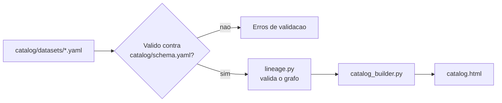
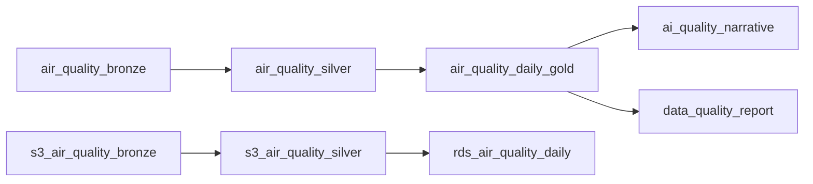

# Governanca e Catalogo de Dados

Framework de governanca (papeis, matriz RACI, politica de retencao,
classificacao de dados com mapeamento a LGPD) combinado com um
catalogo de dados funcional: um script Python que le definicoes YAML
de cada dataset do portfolio e gera uma pagina HTML navegavel com
linhagem, dono e sensibilidade de cada um.

Projeto 08 de uma serie documentando minha transicao de Analista de
Dados para Arquitetura de Dados - veja o [perfil
completo](https://github.com/amanda-martins-data).

## Por que este projeto

Governanca de dados costuma ser tratada como teoria - regras que
ninguem verifica de fato. Aqui o catalogo e codigo real: cada
dataset e um arquivo YAML validado contra um contrato
(`catalog/schema.yaml`), e o proprio grafo de linhagem e verificado
em busca de referencias quebradas ou datasets derivados sem origem
declarada.

Diferencial pessoal: ja geri governanca regulatoria real - relatorios
GRI, indicadores ESG para o ISE B3, disclosures alinhados ao DJSI.
O framework de governanca de dados deste projeto (papeis, RACI,
retencao, classificacao) aplica a mesma disciplina de auditoria e
consequencia real que uso profissionalmente para compliance
ambiental - inclusive o mapeamento explicito a LGPD.

## Arquitetura



## Estrutura

```
.
├── docs/
│   ├── framework-governanca.md   # papeis, RACI, retencao
│   └── classificacao-dados.md    # sensibilidade + LGPD
├── catalog/
│   ├── schema.yaml               # contrato que cada dataset segue
│   └── datasets/                 # 8 YAMLs, um por dataset do portfolio
├── src/
│   ├── catalog_builder.py        # le, valida e gera o HTML
│   └── lineage.py                # monta e valida o grafo de linhagem
└── tests/                        # 19 testes, todos offline
```

## Datasets catalogados

Cobre os dois pipelines paralelos do portfolio (Projeto 03: Parquet
lake / Projeto 04: S3 + RDS) e os dois consumidores de IA e
qualidade que leem da Gold (Projetos 05 e 06):



## Como rodar

```bash
pip install -r requirements.txt

# rodar os testes (19 testes, incluindo carga real dos 8 YAMLs)
python -m pytest tests/ -v

# gerar o catalogo HTML a partir dos YAMLs
python src/catalog_builder.py
# escreve out/catalog.html
```

## Validacao

**19/19 testes passando**, cobrindo:
- Validacao de dataset contra o contrato (campos obrigatorios, layer
  valida, sensibilidade valida, upstream como lista)
- Deteccao de referencia de linhagem quebrada e de dataset derivado
  sem upstream declarado
- Montagem da cadeia de linhagem completa, incluindo protecao contra
  ciclo no grafo
- Carga real dos 8 YAMLs deste repositorio (nao mockados) confirmando
  zero erros de validacao
- Ausencia de emoji no HTML gerado

## Proximos passos do portfolio

Este catalogo cataloga datasets do portfolio manualmente via YAML.
Um proximo passo natural seria o `catalog_builder.py` inspecionar os
proprios arquivos Parquet/schemas dos Projetos 01-06 e gerar parte
dos metadados automaticamente, reduzindo o risco de o YAML ficar
desatualizado em relacao ao dado real.
